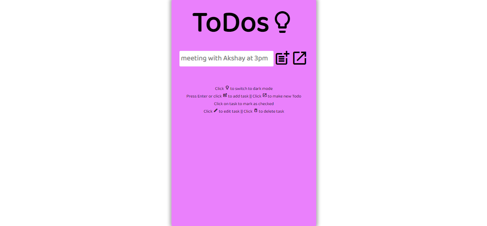
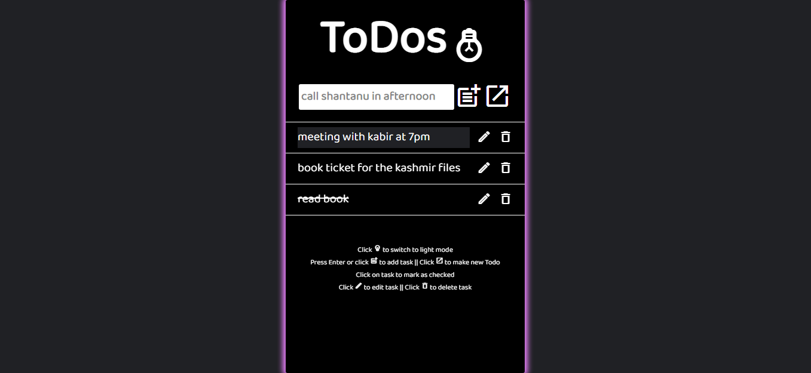

# todo-app

It is a simple webpage where user can list down the tasks or activities that he/she will do. It has a smooth UI and easy to use functionalities. It helps user to stay organized. User can add their tasks, can mark them as completed, can edit task, can delete a particular task or delete all the tasks as well. It uses local storage for storing the data of the user.

## Screenshot

## [Live Demo](https://AkshayManiar.github.io/todo-app/)

### Features:

- User can add new task
- User can edit any particular task for correction
- User can mark as checked or completed for a particular task
- User can delete any particular task
- User can view all list of tasks

## Credits

- [Fonts Google](https://fonts.google.com/icons)(Icons)
- [Ek Type](https://fonts.google.com/specimen/Baloo+Bhaijaan+2)(Fonts)
